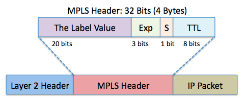

# Konfig af BGP / VPNv4

Dette kode bruger man til at konfigurer VPNv4 med BGP (IBGP)
```
router bgp 65400
neighbor 1.1.1.1 remote-as 65400
update-source lo 1
no auto-summary
address family vpnv4 # Router protocol bruger vpn ver 4 prefix
neighbor activate 4.4.4.4
```
Som man kan se på As numret så er det IBGP vi bruger, da vores nabo har samme AS nummer.

# VRF

``` 
ip vrf kunde-1
rd 65400:1
route-target both 65400:1
```
### ip vrf kunde-1
 ```ip vrf kunde-1``` fortæller hvad vi ønsker kunden skal "hedde".<br>
 Dette kommer vi også til at bruge når vi skal forward det, og sende det igennem OSPF og BGP.
### rd 65400:1
``` rd 65400:1 ``` er det unikke ID vi ønsker at give til virksomheden.<br>
Dette ID vil isolere virksomhedens VRF fra andres. <br>
Dette tillader også at virksomhederne kan bruge samme IP, uden at der opstår en IP conflict.

ID'et kan i princippet være lige det du ønsker. Her har jeg dog valgt at have det AS nummret på, samt deres kundenummer (1)
Så bliver det mere overskuligt når man skalere det.

### route-target both 65400:1
Route-target kan have 3 værdiger Import, export, og Both. <br>
```Export``` exportere sin tabel til andre, i det samme RT.<br>
```Import``` impotere tabeller fra andre, i det samme RT<br>
```Both``` er importere og exportere tabeller (Routing)<br>

ID'et der bruges her er ikke det samme som ved RD, men det anbefales at have det samme ID, hvilket gør det mere overskuligt.

# Hvad er VPNv4 i BGP?

VPNV4 er enelig bare en protocol / funktion der gør det muligt at lave en VPN tunnel over et offentligt netværk der køere over BGP.
Hele iden med det er at det er en vigtig komponet til **MPLS,** som gør det nemt at lave scalerebare VPN'er

# Naboskab

Se om naboskabet med vpnv4 er oppe, ved at skrive:
```
 sh bgp vpnv4 unicast all summary
```

# VRF Forwarding og deling af routings tabeller.

### Forwarding
Vi skal fortælle vores PE router hvor henne den skal forward til. <br>
Så vi skal pege den over på vores CE router.
```
interface fastethernet 0/1
ip address 172.16.0.1 255.255.255.0
ip vrf forwarding kunde-1
ip nat inside
ip ospf 2 area 1
no shutdown
```

Her er de to vigtiste punkter `ip vrf forwarding kunde-1` og ip `ospf 2 area 1`

`ip vrf forwarding kunde-1` betyder at interfacet skal bruge VRF kunde-1. <br>
Når dette er slået til, så kan andre ikke længere pinge interfacet, medmindre de er medlem af kunde-1 VRF'en.

`ospf 2 area 1` betyder bare at vi bruger OSPF area 2 til vores VPN. 
Denne OSPF vil ikke blive delt med routerns normale routing table.
Den vil i stedet blive delt i VRF kunde-1's routing table.

Så der er ingen andre routere der kan "Se" denne route.

### OSPF > BGP
Nu skal vi overføre vores OSPF til BGP, så rouerne kan sende vores VRF kunde-1 route vidre til den næste PE Router.<br>
Så vi skal ind på vores `router bgp 65400` igen, for at opdatere den med følgende info:

```
address-family ipv4 vrf kunde-1
redistribute ospf 2
```
Her laver vi en `Address-family` i BGP. (kunde-1)<br>
Inde på denne sub-commando tilføjer vi `redistribute ospf 2`

Disse OSPF-ruter overføres nu til BGP i VRF "kunde-1". Bemærk, at denne ruteinformation forbliver skjult for andre BGP-tabeller, fordi den er specifik for VRF'en "kunde-1."


### BGP > OSPF

Vi skal også sørgere for at importere vores OSPF (Der ligger i BGP) over til OSPF igen. 

Dette vil være den trafik som modparten sender til os.<br>
Dette kan gøres super nemt med dene kommando:

```
Router ospf 2
redistribute bgp 65400 subnets
```
Den sidste del `subnets` er muligivs ikke 100% nødvendig på alle slags routere<br>
Men jeg har valgt at tage den med just in case.

Som det let kan læses ud fra kommandoen, så overfører vi bare BGP 65400 subnets vidre ind i vores OSPF ID 2 AREA 1


# DIverse 

### loopback

Der er konfiguret et loopback interface på hver router. 
Det er vigtigt på nogen Cisco OS'er at det er en /32.

Her er konfiguratinen fra R1

```
interface loopback 1
ip address 1.1.1.1 255.255.255.255
```

### OSPF area 0 
Inde i ISP'en er der konfiguret OSPF area 0, på alle ISP routerne.
```
router ospf 1
network 10.10.10.0 0.0.0.255 area 0
network 1.1.1.1 0.0.0.0 area 0
mpls ldp autoconfig
```
HEr er der en vigtig kommando: `mpls ldp autoconfig`.<br>
Dette sætter automatisk LDp op, hvilket er det der bruges til distribution er de her labels i MPLS.

det skal på alle routere, der skal være en del af MPLS netværket.
 
Når jeg siger AUtomatisk mner jeg bare at vi fortæller routeren at den skal bruge standartindstillingerne. 


### Hvad er MPLS
Det er en måde at sende pakker på.
Vi bruger MAC på L2, og IP'er på L3.
Men med MPLS bruger vi noget der hedder labels.<br>
Man kan vel kalde det en L2.5

Her kan man se hvad headeren indholder:
<br>
Exp delen er ret nice, her kanman bruge de 3 bits til QoS.

### Show kommandoer:

`show mpls forwarding` her får vi en tabel over hvilke pakker/labels der skal vidresendes på den angivnde router.<br>


**Local tag:** Dette er labelen, der er knyttet til pakken på dette niveau. Hver label bruges til at dirigere pakken til det næste hop.

**Outgoing tag or VC:** Dette er den label eller Virtual Circuit (VC), der skal anvendes på den udgående pakke for at dirigere den korrekt på det næste hop. Hvis der står "Pop tag," betyder det, at den udgående pakke ikke længere har brug for en MPLS-label og bliver "unlabeled" (normal IP-pakke).

**Prefix or Tunnel Id:** Dette er den destination, som pakken forsøger at nå. Det kan være en IP-adresse eller en tunnel-ID afhængigt af routingbehovet.

**Bytes switched:** Dette er mængden af data, der er blevet videresendt ved hjælp af denne label.

**Outgoing interface:** Dette er den udgående interface, hvor pakken sendes videre til det næste hop.

**Next Hop:**Dette er IP-adressen på den næste router, som pakken sendes til.

---
`show mpls interfaces` Denne kommando viser MPLS-konfigurationen for alle interfaces på routeren. Det kan give dig information om, hvilke interfaces der er aktiveret til MPLS, og hvilke der ikke er.<br>


---
`show mpls ldp bindings` Denne kommando viser bindingsinformationen for MPLS-labels, der er tildelt og modtaget fra naboer. Dette giver dig et overblik over, hvilke labels der er i brug på routeren.<br>


---
`show mpls ldp discovery`  Denne kommando viser opdagelsesoplysninger for MPLS LDP, herunder hvilke interfaces der er indstillet til at lytte efter LDP-naboer.<br>


Her kan vi set at, R4 har fundet 3.3.3.3, hviket er R3's Lo interface / RID
# Netværkstegning 


[Link til R1](/Netværk/Routere/R1.ios) -
[Link til R2](/Netværk/Routere/R2.ios) -
[Link til R3](/Netværk/Routere/R3.ios) -
[Link til R4](/Netværk/Routere/R4.ios)<br>
[Link til kunde-1-R1](/Netværk/Kunde1/Kunde1.ios) -
[Link til kunde-1-R2](/Netværk/Kunde1/Kunde1-2.ios)
